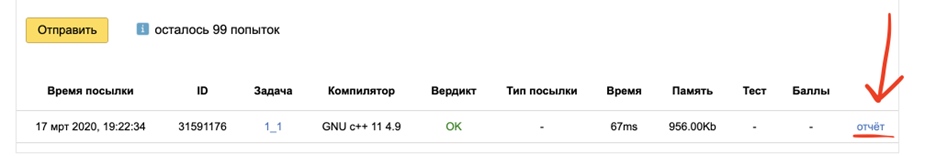

# Репозиторий по курсу «Алгоритмы и структуры данных» (АиСД)

## Оглавление

* [Общая информация](#общая-информация)
* [Технологический стек](#технологический-стек)
* [Требования к коду](#требования-к-коду)
* [Правила сдачи](#правила-сдачи)
    * [Общие правила сдачи](#общие-правила-сдачи)
    * [Правила удалённой сдачи](#правила-удалённой-сдачи)
    * [Правила сдачи РК](#правила-сдачи-рк)
* [Оценивание](#оценивание)
    * [Итоговая оценка](#итоговая-оценка)
    * [Минимальный набор задач](#минимальный-набор-задач)
* [Структура проекта](#структура-проекта)
* [Лицензия](#лицензия)
* [Итоги курса](#итоги-курса)

## Общая информация

Курс осваивается в рамках программы по веб-разработке от VK Education

**Цель курса** - Узнать об основах алгоритмического программирования, научиться применять базовые алгоритмы и структуры, получить представление о времени их работы и эффективности.

* **Поток**: Весна 2026
* **Учебная группа**: WEB-13

## Технологический стек

* **Язык программирования**: `C++`
* **Линтер:** `cpplint`, [Google C++ Style Guide](https://google.github.io/styleguide/cppguide.html)
* **Среды разработки**: с поддержкой пошаговой отладки (`Visual Studio Code`)

## Требования к коду

### Общие правила и оформление

* Только `С++`;
* Наличие комментариев, объясняющих нетривиальные моменты в решении;
* Необходимо придерживаться одного стиля написания кода.
    Возможные варианты:
    * [Google](http://google.github.io/styleguide/cppguide.html), [автоматическая проверка](http://cpplint.appspot.com/)
    * [GNU](https://gcc.gnu.org/codingconventions.html)
    * [Поиск@Mail.ru](https://github.com/akrymov/technopark_common/blob/master/cppguide.md)
* В шапке сдаваемого `.cpp` должно находиться закомментированное условие задачи;
* Все переменные и функции должны иметь осмысленное имя. Однобуквенные имена разрешаются только для счётчиков цикла и для переменных, заданных в условии задачи;
* Переменные должны объявляться по месту использования.

### Архитектура и структура

* Код решения должен быть грамотно разбит на функции: в `main` должен находиться ввод данных, вызов функции, которая решает задачу, вывод результата. Ввод/вывод производится только в `main`, решение - только в отдельном наборе функций и/или классов;
* Каждой структуре данных должен соответствовать класс с продуманным стандартным публичным интерфейсом;
* Все переменные базового типа должны при объявлении инициализироваться, классы и структуры должны иметь конструктор.

### Работа с памятью

* Массивы неконстантного размера, а также большого константного размера необходимо выделять в динамической памяти;
* На каждый вызов аллокации памяти должен быть вызов освобождения памяти, `new -> delete`. Начиная со второго модуля штраф “-1” за любую утечку памяти в сдаваемом и показываемом коде;
* Вызов `delete` должен быть в той же логической области видимости что и вызов new (либо в той же функции, либо в том же классе);
* Необходимо соблюдать правило трёх: если у класса есть деструктор, конструктор копирования и/или оператор присваивания,то должны быть все три.

### Алгоритмы, проверки и ограничения

* Для проверки входных данных и работы встроенных функций рекомендуется использовать `assert(...)`;
* Глобальными переменными пользоваться нельзя;
* Рекурсией произвольной глубины пользоваться нельзя. Ей можно пользоваться, только если вы уверены, что глубина не превысит `1000`;
* Для каждой задачи необходимо определить скорость работы и потребляемую память;
* Реализованное решение должно быть максимально эффективным;
* **Любое дублирование чужого кода штрафуется “-5” и незачётом по задаче. Запрещено списывать и давать списывать. За это -5 и незачёт по задаче получают и списывающий, и дающий списывать.**

## Правила сдачи

### Общие правила сдачи

1. Соответствие [требованиям к коду](#требования-к-коду);
2. Задача должна соответствовать требованиям, указанным в условии;
3. Каждая сдаваемая задача предварительно должна быть сдана в тестирующую систему;
4. Задача, загруженная в Я.Контест до его закрытия, может досдаваться студентом неограниченное число раз - на усмотрение преподавателя;
5. Задача должна пройти защиту у преподавателя;
6. Содержание тестов задачи из Я.Контеста можно получить, предъявив свой набор тестов для этой задачи.

### Правила удалённой сдачи

Для сдачи задач нужно послать своему преподавателю письмо на e-mail, в теме которого указать метку `[TPSpring2026]`, свой поток (`WEB`/`ML`), свое имя и фамилию.

В теле письма нужно указать:

* оперативный контакт;
* ссылки на посылки в контесте, которые вы хотите сдавать.

На одну сдачу - один тред в почте.

Пример письма:

```text
Тема: [TPSpring2026] WEB Иванов Иван
Тело письма:

Телега: @adfafadsf

Прошу принять задачи

Задача 1 вариант 1 https://contest.yandex.ru/contest/17460/run-report/31591176/
Задача 2 вариант 4 https://contest.yandex.ru/contest/17460/run-report/31591176/
```

Ссылка на посылку находится здесь:


Гарантируется, что обратная связь по письму будет в течение 7 календарных дней.

### Правила сдачи РК

1. РК представляет собой контест с задачами, которые надо решить онлайн. Контест стартует в определенное время и у вас будет 1-1.5 часа (в зависимости от РК) на решение задач. По истечению времени контест закрывается;
2. Студент присылает ссылки на задачи в почту преподавателю;
3. Если задача выполнена в соответствии с условием и все тесты проходят, то задача засчитывается.

## Оценивание

### Итоговая оценка

* Отлично – 84-100 баллов;
* Хорошо – 67-83 балла;
* Удовлетворительно – 50-66 баллов.

Для получения зачета нужно набрать >= 50 баллов, решив при этом минимальный набор задач.

### Минимальный набор задач

Сдача всех задач из списка ниже является необходимым условием для получения зачета по курсу АиСД.

* **Модуль 1**

    * Задача 2 (4 балла)
    * Задача 4 (4 балла)
    * Задача 6 (3 балла)

* **Модуль 2**

    * Задача 1 (6 баллов)
    * Задача 2 (4 балла)
    * Задача 4 (5 баллов)

* **Модуль 3**

    * Задача 1 (5 баллов)
    * Задача 2 (3 балла)
    * Задача 3 (4 балла)

## Структура проекта

Репозиторий логически разделен на модули в соответствии с программой курса «Алгоритмы и структуры данных». 

* **`.vscode/`** — конфигурационные файлы (`launch.json`, `settings.json`, `tasks.json`) для комфортной разработки, сборки и отладки C++ кода.
* **`assets/`** — графические ресурсы и изображения, используемые для оформления документации.
* **`module1/`, `module2/`, `module3/`** — основные папки, разбитые по учебным модулям. Внутри каждого модуля находятся:
    * `README.md` — файл с общими требованиями, ссылками на контесты, сроками сдачи и детальными условиями задач текущего модуля.
    * `task1/`, `task2/` и т.д. — директории с решениями стандартных домашних задач (каждая содержит файлы реализации, такие как `main.cpp`).
    * `rk1/`, `rk2/`, `rk3/` — директории рубежных контролей. Внутри каждой из них находится собственный `README.md` с правилами проведения контроля и условиями конкретных вариантов, а также файлы с исходным кодом решений.
* **Корневые файлы проекта:**
    * `README.md` — главный файл с общим описанием репозитория, технологического стека, требований к коду и правил сдачи.
    * `LICENSE` — файл с текстом лицензии, определяющей права на использование и распространение исходного кода.
    * `.clang-format` — правила автоматического форматирования кода в соответствии с выбранным стилем.
    * `CPPLINT.cfg` и `cpplint.py` — конфигурация и исполняемый скрипт для статического анализа (линтера) C++ кода.
    * `.gitignore` — список файлов и скомпилированных бинарников, которые игнорируются системой контроля версий Git.

## Лицензия

Этот проект распространяется под лицензией GPL-3.0. Подробности можно найти в файле [LICENSE](./LICENSE).

## Итоги курса

Курс «Алгоритмы и структуры данных» от VK Education освоенный в рамках программы по веб-разработке завершен с выдающимся результатом: абсолютный максимум в **99 из 99 баллов** и итоговая оценка **5/5**. Настоящим испытанием на прочность стал второй модуль, в рамках которого проводилось соревнование по реализации алгоритма сжатия данных Хаффмана с жестким лимитом памяти (не более 10 бит на каждый 8-битный символ). В этом состязании удалось не просто выполнить все требования, но и обойти коллег, написав самое эффективное решение на потоке, которое обеспечило лучший коэффициент сжатия и заслуженное первое место.
