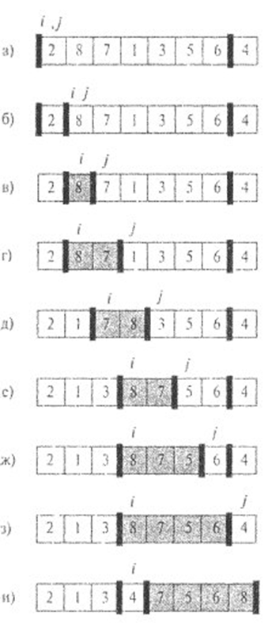

# Модуль №1

**Сдать задание нужно до 6 апреля 2026 г. (18:00) включительно.**

* [Ссылка на контест](https://contest.yandex.ru/contest/91716/enter)
* [Ведомость](https://docs.google.com/spreadsheets/d/1fnda4M9gAXTRRA4Y0mNThhMF4dBFSmFCLCis-CBlBH8)
* [Ссылка на правила](https://docs.google.com/document/d/1ZVEZwgJ3N8GFeAPwESQIqjl1ia2UjelN-aS4ftyJudg)

**Общие требования для всех задач**:

* Ввод/вывод отделены от решения.
* Не должно быть утечек памяти, за каждую утечку памяти - штраф `-1`.

Мои варианты:

* [Задача № 1 - 3](#-13)
* [Задача № 2 - 4](#-24)
* [Задача № 3 - 3](#-33)
* [Задача № 4 - 2](#-42-топ-k-пользователей-из-лога)
* [Задача № 5 - 2](#-52-современники)
* [Задача № 6 - 2](#-62)
* [Задача № 7 - 2](#-72-lsd-для-long-long)


## Задача № 1 (3 балла)

* Во всех задачах необходимо использование битовых операций.
* *Использование арифметических операций запрещено.*
* Входное число лежит в диапазоне $0..2^{32} - 1$ и вводится в десятичном виде.

### № 1.1

[Ссылка на отчёт](https://contest.yandex.ru/contest/91716/run-report/159066505/)

Подсчитать кол-во единичных бит во входном числе, стоящих на четных позициях. Позиции битов нумеруются с `0`.

| in   | out |
| :--- | :-- |
| `25` | `2` |

### № 1.2

[Ссылка на отчёт](https://contest.yandex.ru/contest/91716/run-report/159067059/)

Вернуть значение бита в числе `N` по его номеру `K`.

* *Формат входных данных.* Число `N`, номер бита `K`.

| in     | out |
| :----- | :-- |
| `25 3` | `1` |
| `25 2` | `0` |

### № 1.3

[Ссылка на отчёт](https://contest.yandex.ru/contest/91716/run-report/159068909/)

Если в числе содержится только один бит со значением `1`, записать в выходной поток `OK`. Иначе записать `FAIL`.

| in   | out    |
| :--- | :----- |
| `32` | `OK`   |
| `34` | `FAIL` |

### № 1.4

Инвертируйте значение бита в числе `N` по его номеру `K`.

* *Формат входных данных.* Число `N`, номер бита `K`.
* *Формат выходных данных.* Число с инвертированным битом в десятичном виде.

| in     | out  |
| :----- | :--- |
| `25 1` | `27` |
| `25 4` | `9`  |

## Задача № 2 (4 балла)

**Обязательная задача.**

### № 2.1

Дан отсортированный массив целых чисел `A[0..n-1]` и массив целых чисел `B[0..m-1]`. Для каждого элемента массива `B[i]` найдите минимальный индекс `k` минимального элемента массива `A`, равного или превосходящего `B[i]: A[k] >= B[i]`. Если такого элемента нет, выведите `n`. `n, m ≤ 10000`.

**Требования:** Время работы поиска `k` для каждого элемента `B[i]`: $O(\log \mathbf{k})$. Внимание! В этой задаче для каждого `B[i]` сначала нужно определить диапазон для бинарного поиска размером порядка `k` с помощью экспоненциального поиска, а потом уже в нем делать бинарный поиск.

* *Формат входных данных.* В первой строчке записаны числа `n` и `m`. Во второй и третьей массивы `A` и `B` соответственно.

| in                            | out     |
| :---------------------------- | :------ |
| `2 1`<br>`1 2`<br>`2`         | `1`     |
| `4 3`<br>`2 4 5 7`<br>`4 6 1` | `1 3 0` |

### № 2.2

Дан массив целых чисел `А[0..n-1]`. Известно, что на интервале `[0, m]` значения массива строго возрастают, а на интервале `[m, n-1]` строго убывают. Найти `m` за $O(\log \mathbf{m})$.

**Требования:** Время работы $O(\log \mathbf{m})$. Внимание! В этой задаче сначала нужно определить диапазон для бинарного поиска размером порядка `m` с помощью экспоненциального поиска, а потом уже в нем делать бинарный поиск.

`2 ≤ n ≤ 10000`.

| in                            | out |
| :---------------------------- | :-- |
| `10`<br>`1 2 3 4 5 6 7 6 5 4` | `6` |

### № 2.3

Даны два массива неубывающих целых чисел, упорядоченные по возрастанию. `A[0..n-1]` и `B[0..m-1]`. `n >> m`. Найдите их пересечение.

**Требования:** Время работы: $O(m \log \mathbf{k})$, где `k` - позиция элемента `B[m-1]` в массиве `A`. В процессе поиска очередного элемента `B[i]` в массиве `A` пользуйтесь результатом поиска элемента `B[i-1]`. Внимание! В этой задаче для каждого `B[i]` сначала нужно определить диапазон для бинарного поиска размером порядка `k` с помощью экспоненциального поиска, а потом уже в нем делать бинарный поиск.

`n, k ≤ 10000`.

| in                                   | out     |
| :----------------------------------- | :------ |
| `5`<br>`3`<br>`1 2 3 4 5`<br>`1 3 5` | `1 3 5` |

### № 2.4

[Ссылка на отчёт](https://contest.yandex.ru/contest/91716/run-report/159070624/)

Дан отсортированный массив различных целых чисел `A[0..n-1]` и массив целых чисел `B[0..m-1]`. Для каждого элемента массива `B[i]` найдите минимальный индекс элемента массива `A[k]`, ближайшего по значению к `B[i]`.

**Требования:** Время работы поиска для каждого элемента `B[i]`: $O(\log \mathbf{k})$. Внимание! В этой задаче для каждого `B[i]` сначала нужно определить диапазон для бинарного поиска размером порядка `k` с помощью экспоненциального поиска, а потом уже в нем делать бинарный поиск.

`n ≤ 110000, m ≤ 1000`.

| in                                      | out       |
| :-------------------------------------- | :-------- |
| `3`<br>`10 20 30`<br>`3`<br>`9 15 35`   | `0 0 2`   |
| `3`<br>`10 20 30`<br>`4`<br>`8 9 10 32` | `0 0 0 2` |

## Задача № 3 (4 балла)

Во всех задачах из следующего списка следует написать структуру данных, обрабатывающую команды `push*` и `pop*`.

* *Формат входных данных.*
  В первой строке количество команд `n`. `n ≤ 1000000`.

  Каждая команда задаётся как `2` целых числа: `a b`.

  ```cpp
  a = 1 // push front
  a = 2 // pop front
  a = 3 // push back
  a = 4 // pop back
  ```

  Команды добавления элемента `1` и `3` заданы с неотрицательным параметром `b`.

  Для очереди используются команды `2` и `3`. Для дека используются все четыре команды.

  Если дана команда `pop*`, то число `b` - ожидаемое значение. Если команда `pop` вызвана для пустой структуры данных, то ожидается "-1".

* *Формат выходных данных.*
  Требуется напечатать `YES` - если все ожидаемые значения совпали. Иначе, если хотя бы одно ожидание не оправдалось, то напечатать `NO`.

### № 3.1

Реализовать очередь с динамическим зацикленным буфером (на основе динамического массива).

**Требования:** Очередь должна быть реализована в виде класса.

| in                                | out   |
| :-------------------------------- | :---- |
| `3`<br>`3 44`<br>`3 50`<br>`2 44` | `YES` |
| `2`<br>`2 -1`<br>`3 10`           | `YES` |
| `2`<br>`3 44`<br>`2 66`           | `NO`  |

### № 3.2

Реализовать дек с динамическим зацикленным буфером (на основе динамического массива).

**Требования:** Дек должен быть реализован в виде класса.

| in                                | out   |
| :-------------------------------- | :---- |
| `3`<br>`1 44`<br>`3 50`<br>`2 44` | `YES` |
| `2`<br>`2 -1`<br>`1 10`           | `YES` |
| `2`<br>`3 44`<br>`4 66`           | `NO`  |

### № 3.3

[Ссылка на отчёт](https://contest.yandex.ru/contest/91716/run-report/159088460/)

Реализовать очередь с помощью двух стеков.

**Требования:** Очередь должна быть реализована в виде класса. Стек тоже должен быть реализован в виде класса (на основе динамического массива).

| in                                | out   |
| :-------------------------------- | :---- |
| `3`<br>`3 44`<br>`3 50`<br>`2 44` | `YES` |
| `2`<br>`2 -1`<br>`3 10`           | `YES` |
| `2`<br>`3 44`<br>`2 66`           | `NO`  |

## Задача № 4 (4 балла)

**Обязательная задача.**

**Требование для всех вариантов Задачи 4**:

* Решение всех задач данного раздела предполагает использование кучи, реализованной в виде **шаблонного класса**.
* **Решение должно поддерживать передачу функции сравнения снаружи.**
* *Куча должна быть динамической.*

### № 4.1 Слияние массивов

Напишите программу, которая использует кучу для слияния `K` отсортированных массивов суммарной длиной `N`.

**Требования:** время работы $O(N \log K)$. Ограничение на размер кучи $O(K)$.

* *Формат входных данных.* Сначала вводится количество массивов `K`. Затем по очереди размер каждого массива и элементы массива. Каждый массив упорядочен по возрастанию.
* *Формат выходных данных.* Итоговый отсортированный массив.

| in                                                      | out               |
| :------------------------------------------------------ | :---------------- |
| `3`<br>`1`<br>`6`<br>`2`<br>`50 90`<br>`3`<br>`1 10 70` | `1 6 10 50 70 90` |

### № 4.2 Топ `K` пользователей из лога

[Ссылка на отчёт](https://contest.yandex.ru/contest/91716/run-report/159088367/)

Имеется лог-файл, в котором хранятся пары для `N` пользователей *(Идентификатор пользователя, посещаемость сайта)*.

Напишите программу, которая выбирает `K` пользователей, которые чаще других заходили на сайт, и выводит их в порядке возрастания посещаемости. Количество заходов и идентификаторы пользователей не повторяются.

**Требования:** время работы $O(N \log K)$, где `N` - кол-во пользователей. **Ограничение на размер кучи $O(K)$**.

* *Формат входных данных.* Сначала вводятся `N` и `K`, затем пары *(Идентификатор пользователя, посещаемость сайта)*.

* *Формат выходных данных.* Идентификаторы пользователей в порядке возрастания посещаемости

| in                                   | out                  |
| :----------------------------------- | :------------------- |
| `3 3`<br>`100 36`<br>`80 3`<br>`1 5` | `80`<br>`1`<br>`100` |

### № 4.3 Планировщик процессов

В операционной системе `Technux` есть планировщик процессов.
Каждый процесс характеризуется:

* приоритетом `P`
* временем, которое он уже отработал `t`
* временем, которое необходимо для завершения работы процесса `T`

Планировщик процессов выбирает процесс с минимальным значением `P * (t + 1)`, выполняет его время `P` и кладет обратно в очередь процессов.

Если выполняется условие `t >= T`, то процесс считается завершенным и удаляется из очереди.

Требуется посчитать кол-во переключений процессора.

* *Формат входных данных.* Сначала вводится кол-во процессов. После этого процессы в формате `P T`
* *Формат выходных данных.* Кол-во переключений процессора.

| in                              | out  |
| :------------------------------ | :--- |
| `3`<br>`1 10`<br>`1 5`<br>`2 5` | `18` |

## Задача № 5 (4 балла)

**Требование для всех вариантов Задачи 5:**

* Во всех задачах данного раздела необходимо реализовать и использовать **сортировку слиянием в виде шаблонной функции**.
* **Решение должно поддерживать передачу функции сравнения снаружи.**
* Общее время работы алгоритма $O(n \log n)$.

### № 5.1 Реклама

В супермаркете решили оптимизировать показ рекламы. Известно расписание прихода и ухода покупателей (два целых числа). Каждому покупателю необходимо показать минимум `2` рекламы. Рекламу можно транслировать только в целочисленные моменты времени. Покупатель может видеть рекламу от момента прихода до момента ухода из магазина.

В каждый момент времени может показываться только одна реклама. Считается, что реклама показывается мгновенно. Если реклама показывается в момент ухода или прихода, то считается, что посетитель успел её посмотреть. Требуется определить минимальное число показов рекламы.

| in                                                      | out |
| :------------------------------------------------------ | :-- |
| `5`<br>`1 10`<br>`10 12`<br>`1 10`<br>`1 10`<br>`23 24` | `5` |

### № 5.2 Современники

[Ссылка на отчёт](https://contest.yandex.ru/contest/91716/run-report/159158428/)

Группа людей называется современниками если был такой момент, когда они могли собраться вместе. Для этого в этот момент каждому из них должно было уже исполниться `18` лет, но ещё не исполниться `80` лет.

Дан список Жизни Великих Людей. Необходимо получить максимальное количество современников. В день `18`-летия человек уже может принимать участие в собраниях, а в день `80`-летия и в день смерти уже не может.

Замечание. Человек мог не дожить до `18`-летия, либо умереть в день `18`-летия. В этих случаях принимать участие в собраниях он не мог.

| in                                                                         | out |
| :------------------------------------------------------------------------- | :-- |
| `3`<br>`2 5 1980 13 11 2055`<br>`1 1 1982 1 1 2030`<br>`2 1 1920 2 1 2000` | `3` |

### № 5.3 Закраска прямой 1

На числовой прямой окрасили `N` отрезков. Известны координаты левого и правого концов каждого отрезка ($L_i$ и $R_i$). Найти длину окрашенной части числовой прямой.

| in                             | out |
| :----------------------------- | :-- |
| `3`<br>`1 4`<br>`7 8`<br>`2 5` | `5` |

### № 5.4 Закраска прямой 2

На числовой прямой окрасили `N` отрезков. Известны координаты левого и правого концов каждого отрезка ($L_i$ и $R_i$). Найти сумму длин частей числовой прямой, окрашенных ровно в один слой.

| in                             | out |
| :----------------------------- | :-- |
| `3`<br>`1 4`<br>`7 8`<br>`2 5` | `3` |

## Задача № 6 (3 балла)

**Обязательная задача.**

Дано множество целых чисел из $[0..10^9]$ размера `n`.

Используя алгоритм поиска `k`-ой порядковой статистики, требуется найти следующие параметры множества:

1. $10\%$ перцентиль
2. медиана
3. $90\%$ перцентиль

**Требования:**

* К дополнительной памяти: $O(n)$.
* Среднее время работы: $O(n)$.
* Должна быть отдельно выделенная функция `partition`.
* Рекурсия запрещена.
* Решение должно поддерживать передачу функции сравнения снаружи.

Функцию `Partition` следует реализовывать методом прохода двумя итераторами в одном направлении. Описание для случая прохода от начала массива к концу:

* Выбирается опорный элемент. Опорный элемент меняется с последним элементом массива.
* Во время работы `Partition` в начале массива содержатся элементы, не бОльшие опорного. Затем располагаются элементы, строго бОльшие опорного. В конце массива лежат нерассмотренные элементы. Последним элементом лежит опорный.
* Итератор (индекс) `i` указывает на начало группы элементов, строго бОльших опорного.
* Итератор `j` больше `i`, итератор `j` указывает на первый нерассмотренный элемент.
* Шаг алгоритма. Рассматривается элемент, на который указывает `j`. Если он больше опорного, то сдвигаем `j`.

  Если он не больше опорного, то меняем `a[i]` и `a[j]` местами, сдвигаем `i` и сдвигаем `j`.
* В конце работы алгоритма меняем опорный и элемент, на который указывает итератор `i`.



### № 6.1

Реализуйте стратегию выбора опорного элемента "медиана трёх". Функцию `Partition` реализуйте методом прохода двумя итераторами от начала массива к концу.

### № 6.2

[Ссылка на отчёт](https://contest.yandex.ru/contest/91716/run-report/159159835/)

Реализуйте стратегию выбора опорного элемента "медиана трёх". Функцию `Partition` реализуйте методом прохода двумя итераторами от конца массива к началу.

### № 6.3

Реализуйте стратегию выбора опорного элемента "случайный элемент". Функцию `Partition` реализуйте методом прохода двумя итераторами от начала массива к концу.

### № 6.4

Реализуйте стратегию выбора опорного элемента "случайный элемент". Функцию `Partition` реализуйте методом прохода двумя итераторами от конца массива к началу.

| in                             | out                |
| :----------------------------- | :----------------- |
| `10`<br>`1 2 3 4 5 6 7 8 9 10` | `2`<br>`6`<br>`10` |

## Задача № 7 (3 балла)

### № 7.1 `MSD` для строк

Дан массив строк. Количество строк не больше $10^5$. Отсортировать массив методом поразрядной сортировки `MSD` по символам. Размер алфавита - `256` символов. Последний символ строки `= '\0'`.

| in                           | out                          |
| :--------------------------- | :--------------------------- |
| `ab`<br>`a`<br>`aaa`<br>`aa` | `a`<br>`aa`<br>`aaa`<br>`ab` |

### № 7.2 `LSD` для `long long`

[Ссылка на отчёт](https://contest.yandex.ru/contest/91716/run-report/159161841/)

Дан массив неотрицательных целых `64`-битных чисел. Количество чисел не больше $10^6$. Отсортировать массив методом поразрядной сортировки `LSD` по байтам.

| in                   | out           |
| :------------------- | :------------ |
| `3`<br>`4 1000000 7` | `4 7 1000000` |

### № 7.3 `Binary MSD` для `long long`

Дан массив неотрицательных целых `64`-разрядных чисел. Количество чисел не больше $10^6$. Отсортировать массив методом `MSD` по битам (бинарный `QuickSort`).

| in                   | out           |
| :------------------- | :------------ |
| `3`<br>`4 1000000 7` | `4 7 1000000` |
